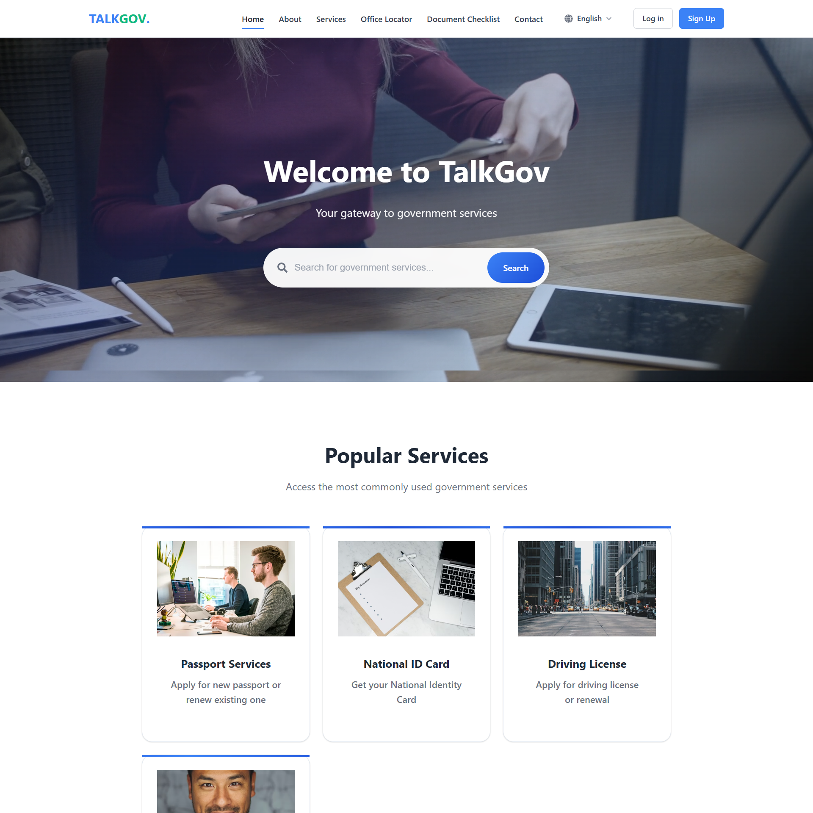
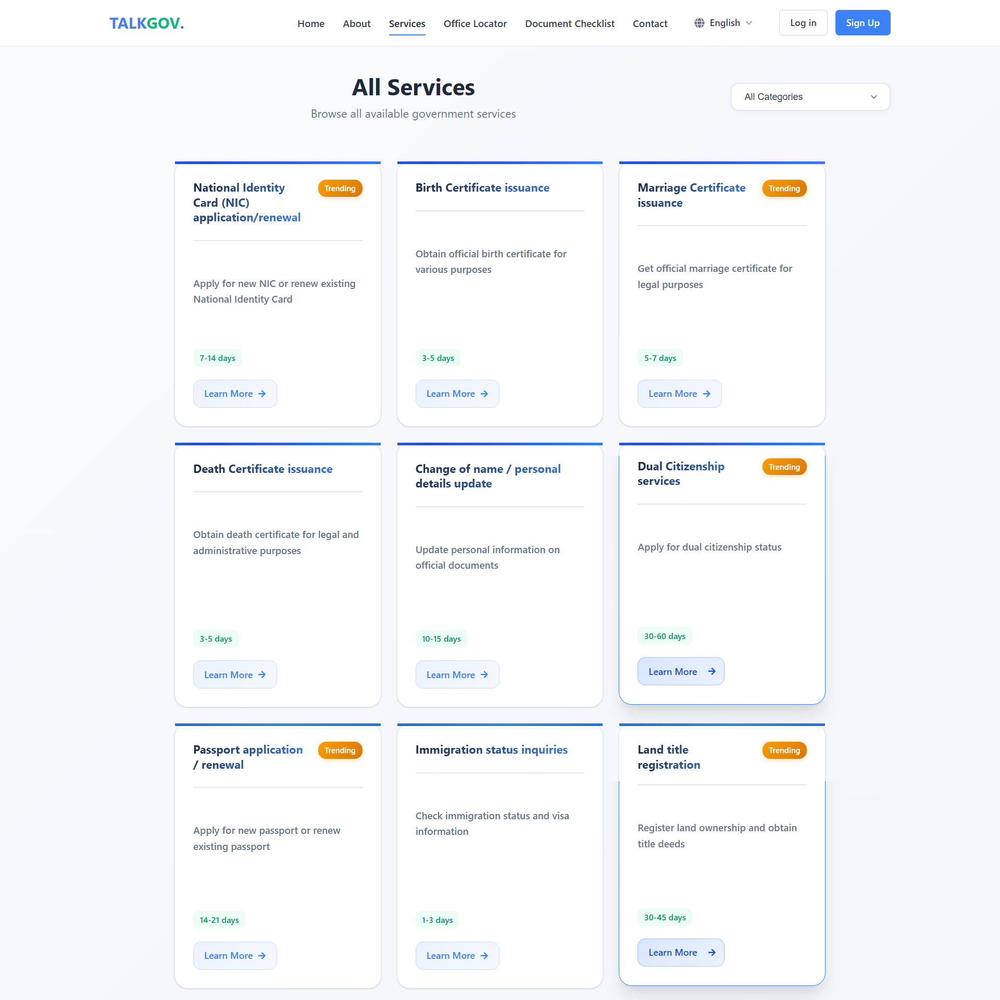
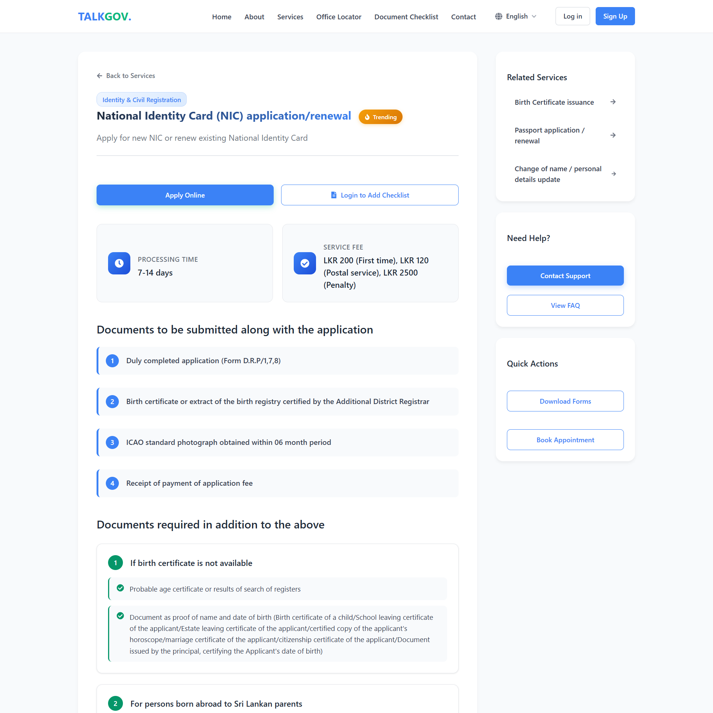
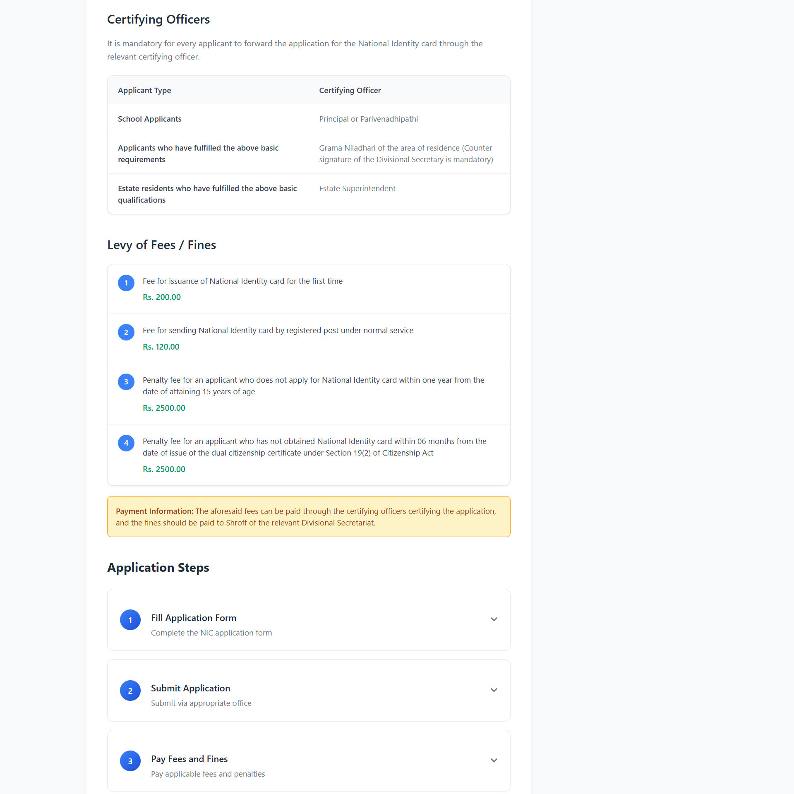
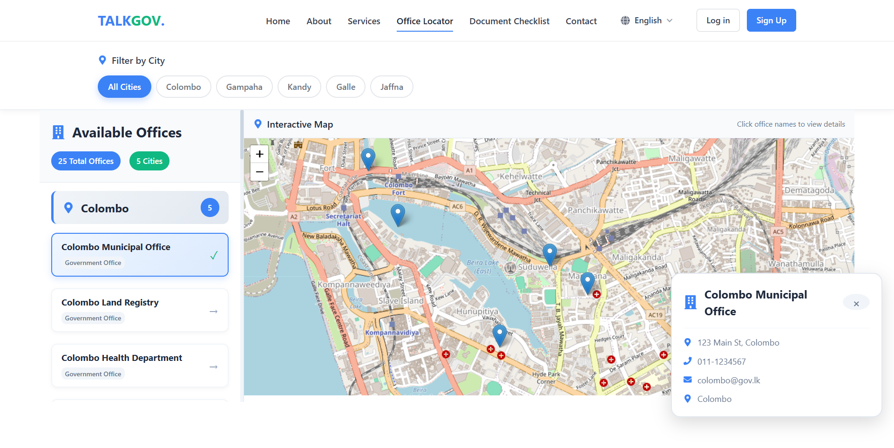

# TalkGov: Centralized Government Services Portal


TalkGov is a full-stack web platform designed to make Sri Lankan government services easier to discover, understand, and prepare for. The system brings together service information, office locations, document checklists, contact support, and a guided assistant experience in one place.

The project is built with a React frontend and a Django REST backend, with PostgreSQL as the primary database.

## Table of Contents

- [Project Overview](#project-overview)
- [Key Features](#key-features)
- [Screenshots](#screenshots)
- [Tech Stack](#tech-stack)
- [System Architecture](#system-architecture)
- [Project Structure](#project-structure)
- [Getting Started](#getting-started)
- [Environment Configuration](#environment-configuration)
- [API Overview](#api-overview)
- [Authentication Flow](#authentication-flow)
- [Current Highlights](#current-highlights)
- [Future Improvements](#future-improvements)
- [Author Notes](#author-notes)

## Project Overview

This portal was developed as a centralized citizen-facing platform for Sri Lankan government service guidance. It helps users:

- browse government services by category
- view required documents, fee summaries, timelines, and office details
- locate government offices on an interactive map
- create and manage document checklists
- register and log in to manage personalized actions
- contact the platform through a support form
- use an assistant layer to navigate service information

The core goal of TalkGov is to reduce confusion and make service preparation more accessible, especially for users who need quick, structured, and easy-to-read guidance.

## Key Features

### Citizen-Facing Features

- Service directory with categorized listings
- Detailed service pages with:
  - document requirements
  - processing time
  - fee summary
  - official department details
  - office locations
  - FAQs and official sources
- Office locator with Leaflet map integration
- User document checklist workflow
- Contact and support submission flow
- Authentication with user registration, login, logout, and profile retrieval
- Multi-language-ready frontend structure using `i18next`

### Backend Features

- Django REST API architecture
- Token-based authentication with DRF
- PostgreSQL database integration
- Data models for:
  - services
  - categories
  - offices
  - service requirements
  - service steps
  - FAQs
  - official sources
  - contact submissions
  - user checklists
  - checklist items

## Screenshots

### Homepage



### Services Directory



### Service Detail Page



### Service Detail Page Variant



### Office Locator



## Tech Stack

### Frontend

- React 19
- Vite
- React Router
- Axios
- React Icons
- Leaflet
- React Leaflet
- i18next

### Backend

- Django
- Django REST Framework
- DRF Token Authentication
- django-cors-headers
- python-decouple
- PostgreSQL

## System Architecture

The application follows a typical frontend-backend separation:

### Frontend

The React application is responsible for:

- routing and page rendering
- service browsing and filtering
- map rendering
- checklist interactions
- user authentication UI
- contact form submission

### Backend

The Django backend is responsible for:

- exposing REST APIs
- managing authentication tokens
- serving structured service data
- persisting contact submissions
- persisting checklist data
- handling service-related models and relationships

## Project Structure

```text
gov-services-centralized-portal/
├── backend/
│   ├── accounts/
│   ├── backend/
│   ├── pages/
│   ├── manage.py
│   └── requirements.txt
├── frontend/
│   ├── public/
│   ├── src/
│   │   ├── assets/
│   │   │   └── images/
│   │   ├── components/
│   │   ├── config/
│   │   ├── data/
│   │   ├── i18n/
│   │   ├── pages/
│   │   └── styles/
│   ├── package.json
│   └── vite.config.js
└── README.md
```

## Getting Started

### Prerequisites

Make sure you have the following installed:

- Node.js 18+
- npm
- Python 3.11+
- PostgreSQL

### 1. Clone the Repository

```bash
git clone https://github.com/your-username/gov-services-centralized-portal.git
cd gov-services-centralized-portal
```

### 2. Backend Setup

Move into the backend folder and create a virtual environment:

```bash
cd backend
python -m venv .venv
```

Activate the environment:

```bash
.venv\Scripts\activate
```

Install backend dependencies:

```bash
pip install -r requirements.txt
```

Run migrations:

```bash
python manage.py migrate
```

Start the backend server:

```bash
python manage.py runserver 127.0.0.1:8000
```

### 3. Frontend Setup

Open a new terminal and move into the frontend folder:

```bash
cd frontend
npm install
```

Start the frontend development server:

```bash
npm run dev -- --host 127.0.0.1 --port 5173
```

### 4. Open the Application

- Frontend: [http://127.0.0.1:5173](http://127.0.0.1:5173)
- Backend API base: [http://127.0.0.1:8000/api](http://127.0.0.1:8000/api)
- Django Admin: [http://127.0.0.1:8000/admin](http://127.0.0.1:8000/admin)

## Environment Configuration

Create a `.env` file inside the `backend` directory.

Example:

```env
SECRET_KEY=your-secret-key-here
DEBUG=True
DB_NAME=fullstack_db
DB_USER=postgres
DB_PASSWORD=your-password
DB_HOST=localhost
DB_PORT=5432
CORS_ALLOWED_ORIGINS=http://localhost:5173,http://127.0.0.1:5173,http://localhost:5174,http://127.0.0.1:5174
```

Frontend environment values can be added to `frontend/.env` if needed.

Example:

```env
VITE_API_BASE_URL=http://127.0.0.1:8000/api
```

## API Overview

### Authentication

- `POST /api/auth/register/`
- `POST /api/auth/login/`
- `POST /api/auth/logout/`
- `GET /api/auth/profile/`

### Service and Platform Data

- `GET /api/pages/overview/`
- `POST /api/pages/assistant/`
- `GET /api/pages/categories/`
- `GET /api/pages/services/`
- `GET /api/pages/services/<slug>/`
- `GET /api/pages/offices/`
- `POST /api/pages/contact/`

### Checklist Endpoints

- `GET /api/pages/checklists/`
- `POST /api/pages/checklists/`
- `GET /api/pages/checklists/<id>/`
- `PATCH /api/pages/checklists/<id>/`
- `DELETE /api/pages/checklists/<id>/`
- `POST /api/pages/checklists/<checklist_id>/items/`
- `PATCH /api/pages/checklist-items/<id>/`
- `DELETE /api/pages/checklist-items/<id>/`

## Authentication Flow

The system uses Django REST Framework token authentication.

### Register

- user submits registration data
- backend creates the user
- token is generated and returned

### Login

- user logs in with credentials
- backend returns user data and auth token
- frontend stores the token and uses it for authenticated requests

### Logout

- token is invalidated on logout
- local frontend auth state is cleared

## Current Highlights

- Clean separation between frontend and backend
- Structured REST API design
- Database-backed service management model
- Map-based office discovery experience
- Reusable pages and component-based frontend structure
- Screenshots included for portfolio and presentation purposes

## Future Improvements

- Full UTF-8 multilingual content completion for Sinhala and Tamil
- Admin-driven content editing for all service pages
- Better search and filtering
- Source-grounded AI assistant responses
- Production deployment with Docker or CI/CD
- Accessibility improvements and comprehensive testing
- Richer analytics and support dashboards

## Author Notes

This project is a strong foundation for a citizen service platform, especially as a university, portfolio, or civic-tech showcase project. It demonstrates:

- full-stack integration
- practical public-service use case design
- data modeling for real-world workflows
- REST API development
- interactive frontend experiences with mapping and authentication

If you want, the next step I can do is:

- create a shorter portfolio-style README version
- add badges and deployment sections
- write a proper `CONTRIBUTING.md`
- create a `README-SETUP.md` with troubleshooting steps
